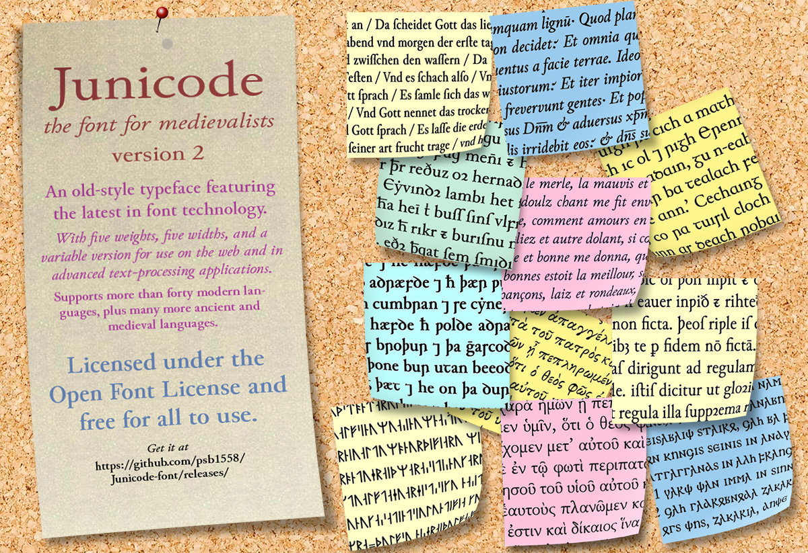

This is the development and distribution site for Junicode 2, a radically rebuilt version of the
widely used free font for medievalists, linguists, and specialists in many academic
disciplines. (Junicode 1.003, the last in the Junicode 1 series, can also be
downloaded here.) Junicode 2 features full compliance with the recommendation of the
[Medieval Unicode Font Initiative](https://skaldic.abdn.ac.uk/m.php?p=mufi),
version 4.0, plus later additions and revisions, and its OpenType programming has
been rebuilt with a view to promoting accessibility and searchability in web pages
and other electronic document formats.

The Junicode 2 font

- has the same character set in all faces (unlike Junicode 1);
- has five weights (Light, Regular, Medium, Semibold, Bold)
- and five widths (Regular, SemiCondensed, Condensed, SemiExpanded, Expanded);
- includes a ttf-flavored variable font with three axes:
  width, weight, and the custom
  [Enlarge](https://psb1558.github.io/Junicode-font/EnlargedAxis.html) axis;
- has improved outlines,
- an expanded collection of small caps (covering all case-paired characters),
- a more comprehensive set of anchors for mark positioning,
- and an expanded collection of OpenType features—carefully chosen and organized to promote
the display of accessible text.

Users of the various versions of Junicode 1 need to be aware that documents
originally set in Junicode 1 may reflow when set in Junicode 2. Further,
documents that use the OpenType features of Junicode 1 (aside from basics like
kerning and standard ligatures) may not be displayed properly when changed over
to Junicode 2.

The latest version of Junicode can be downloaded [here](https://github.com/psb1558/Junicode-font/releases).

**PLEASE NOTE:** A great many commercial websites offer versions of Junicode. The fonts offered
by these sites are always *seriously* out of date. Often they are accompanied by incorrect licenses
or other faulty information, and often the packages they offer are incomplete.
If the archives in which these fonts are packaged are
corrupt or infected with malware, **that is not the responsibility of Junicode’s developer.**
Always use versions of Junicode downloaded from this site, or from reputable Open Source repositories
like Homebrew or those that serve Linux distributions. This site **will not support** versions of Junicode downloaded
from commercial websites.

# Resources

A [specimen](https://psb1558.github.io/Junicode-font/) page.

~~My Twitter feed, where I'll share new developments from time to time.~~

A [discussion forum](https://github.com/psb1558/Junicode-font/discussions) where you can post queries about Junicode and how to use it.

An [essay](https://psb1558.github.io/Junicode-font/Searchability.html) on making Searchable and accessible texts with Junicode.

An [introduction](https://psb1558.github.io/Junicode-font/EnlargedAxis.html) to the Enlarge axis: what it's for and how to use it.

[Test/demonstration](https://psb1558.github.io/Junicode-font/Junicode-2-feature-test.html) of
high-level CSS font properties in Junicode 2.

# Building Junicode

If you want to build Junicode for yourself, you'll need a Python environment with
version 3.10.4 or higher and these Open Source apps:

- fontmake (Python app -- install with pip)
- glyphspkg (Python app -- install with pip)
- psautohint (for hinting `.otf` fonts -- Python app -- install with pip)
- xgridfit (for hinting `.ttf` fonts -- Python app -- install with pip)
- [ttfautohint](http://freetype.org/ttfautohint/) (for hinting static `.ttf` fonts)
- Various utilities that should already be installed on Mac OS and Linux systems: the Bash shell, xsltproc, sed, mktemp, basename.

The Bash script `build_font` must be run once for roman fonts and again for italic.
It creates two directories: `build`, a temporary directory,
which will be replaced next time the script is run (or you can delete it yourself),
and `dist`, where it will place the finished
fonts. Make sure the script is executable and run it from the command line:

- with no argument (or **ttf**) to create a collection of static `.ttf` fonts.
- with the argument **otf** to create `.otf` fonts
- with the argument **variable** to create TrueType-flavored variable fonts

These options are available:

- **-r** build roman fonts (this is the default).
- **-i** build italic fonts.
- **-n** skip hinting the fonts.
- **-s** produce a minimal set of fonts or instances: Regular, Italic, Bold, Bold Italic.
- **-u** skip the step of replacing the `build` directory and use previously generated UFOs in that directory.
- **-d &lt;dir&gt;** source directory (default is `./`).
- **-b &lt;dir&gt;** build directory (default is `./build`).
- **-o &lt;dir&gt;** output directory (default is `./dist`).

